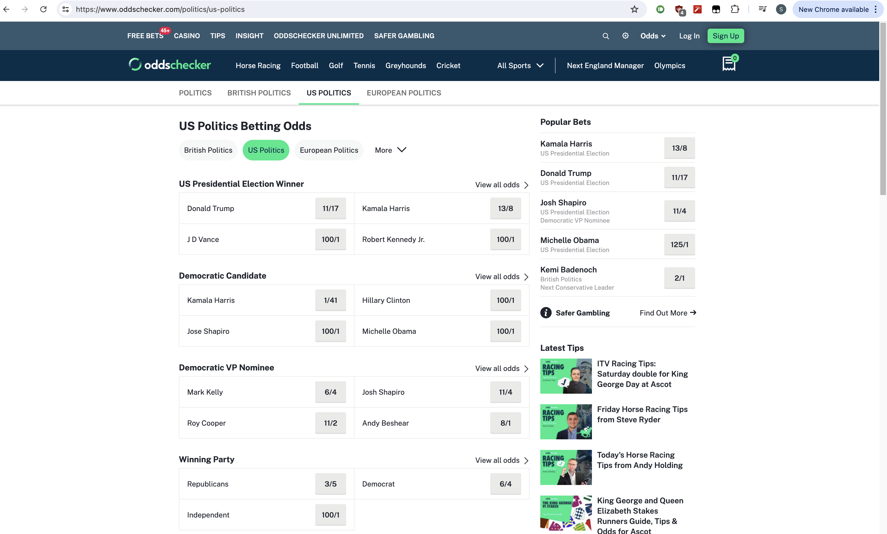

# What

This tiny browser extension or tamper monkey script displays odds as percentages on oddschecker.com.

# Why?

Oddschecker normally displays odds in 'odds' format, for example Trump is 11/17 (pronounced "eleven to seventeen", or "eleven for seventeen"). To a non-gambler, these don't mean much. But 60.7% is much more meaningful.

# Example

Before                     |  After 
:-------------------------:|:-------------------------:
  |  

### Same, zoomed in

Before                     |  After 
:-------------------------:|:-------------------------:
  |  

# Installation 

### Chrome Extension

1. Clone this repo, 
2. Go to `chrome://extensions/` in the address bar Google Chrome
3. Enable Developer Mode
4. Click on "Load unpacked" and select the folder you cloned

### Tamper Monkey

Also available as a Tamper Monkey script: <a href="scripts/tm-odds-to-percentage.js">scripts/tm-odds-to-percentage.js</a>

# Examples

- <a href="https://www.oddschecker.com/politics/us-politics">US Politics</a>

- <a href="https://www.oddschecker.com/politics/european-politics">European Politics</a>

- <a href="https://www.oddschecker.com/politics/british-politics">British Politics</a>

- <a href="https://www.oddschecker.com/politics/australian-politics">Australian Politics</a>
